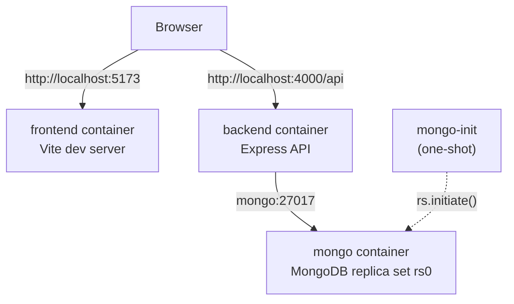
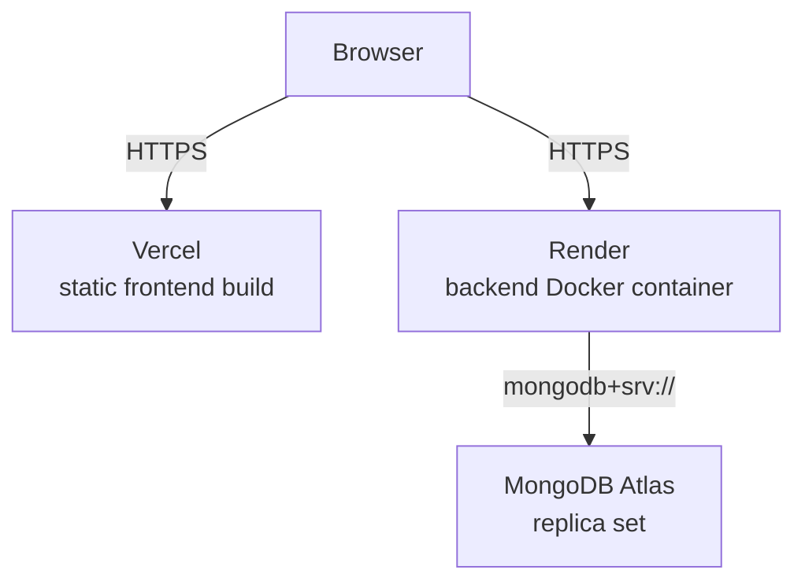

# Docker Setup & Deployment Guide

This document is the complete guide to running Eventra - Campus Event Platform
locally with Docker, and to deploying it to production. If you're new to
this repository, start here.

---

## 1. Overview

Docker provides everything project-specific for local development:

- Node.js runtime for both the backend and frontend
- MongoDB, running as a single-node **replica set** (required - the
  registration/cancellation logic uses multi-document Mongo transactions)
- Correct networking between the three services
- Correct startup order (Mongo → replica set init → backend → frontend)

**You still need Docker itself.** Nothing else project-specific.

**Architecture** (see also §17 below for a diagram):

- `backend` - Node.js/Express/Mongoose REST API, port `4000`
- `frontend` - React 18 + Vite SPA, port `5173` in dev (served by Vite's
  dev server), built to static files for production
- `mongo` - MongoDB 7, running with `--replSet rs0`
- `mongo-init` - a one-shot job that initializes the replica set once

This is a plain two-service app (no shared/workspace packages), so there's
no cross-package build-order problem to solve - each of `backend` and
`frontend` is an independent Docker build context.

---

## 2. Prerequisites

### Required on your machine

- **Docker Desktop** (or Docker Engine + Docker Compose v2 on Linux)

### NOT required on your machine

- Node.js / npm
- MongoDB
- Any other project-specific tool

You only need a text editor and Docker.

---

## 3. Installing Docker

- **Windows / macOS**: install [Docker Desktop](https://www.docker.com/products/docker-desktop/). It bundles Docker Engine, the CLI, and Compose v2.
- **Linux**: install [Docker Engine](https://docs.docker.com/engine/install/) for your distro, then the [Compose plugin](https://docs.docker.com/compose/install/linux/) (`docker compose`, not the old standalone `docker-compose`).

Verify with:

```bash
docker --version
docker compose version
```

---

## 4. Repository Setup

```bash
git clone <repository-url>
cd eventra
```

---

## 5. Environment Setup

Copy the root env template:

```bash
cp .env.example .env
```

Open `.env` and set `JWT_SECRET` to a real random value, e.g.:

```bash
[Convert]::ToBase64String((1..32 | ForEach-Object { Get-Random -Maximum 256 }));
```

That's the only value you must supply. Everything else the backend needs
(Mongo host, ports, CORS origin) is determined by `docker-compose.yml`
itself, because those are container-networking facts, not secrets - they'd
just be duplicated, driftable configuration if they also lived in `.env`.

`backend/.env.example` and `frontend/.env.example` still exist and are used
if you run the apps **without Docker** (`npm run dev` directly on your
machine, pointed at your own local `mongod`). They are not read by
`docker-compose.yml`.

---

## 6. First Startup

```bash
docker compose up --build
```

What happens, in order:

1. `mongo` builds/starts and waits until it responds to pings (healthcheck).
2. `mongo-init` runs once against `mongo`, initializing the `rs0` replica
   set (or confirming it's already initialized, on subsequent runs).
3. `backend` builds, installs dependencies, starts with `node --watch
   server.js`, and waits until `/api/health` responds `200` (healthcheck).
4. `frontend` builds, installs dependencies, and starts the Vite dev server.

The first run takes longer (image builds, `npm ci`, pulling `mongo:7.0`
and `nginx:1.27-alpine`). Subsequent runs are fast - Docker caches the
dependency layers, and named volumes keep `node_modules` warm.

---

## 7. Accessing the Application

| What | URL |
|---|---|
| Frontend | http://localhost:5173 |
| Backend API | http://localhost:4000/api |
| Backend health | http://localhost:4000/api/health |
| MongoDB (for a GUI client like Compass, if you want one) | `mongodb://localhost:27017/campus-events?replicaSet=rs0` |

---

## 8. Development Workflow

```bash
# Start (foreground, logs streaming)
docker compose up

# Start (background)
docker compose up -d

# Stop (containers removed, volumes kept)
docker compose down

# Rebuild after changing package.json/Dockerfile
docker compose up --build

# Rebuild+restart just one service
docker compose up --build backend

# Logs
docker compose logs -f
docker compose logs -f backend

# Shell into a running container
docker compose exec backend sh
docker compose exec frontend sh
```

**Hot reload**: your local `backend/` and `frontend/` folders are bind-mounted
into the containers, so editing source files on your machine takes effect
immediately - `node --watch` restarts the API, Vite HMR updates the browser.
`node_modules` is kept in a named Docker volume (not bind-mounted), so
container-installed dependencies aren't clobbered by your host filesystem.

If you add/remove an npm dependency, run `docker compose up --build` for
that service so the image layer with `npm ci` re-runs.

---

## 9. Database Workflow

- Data lives in the named volume `mongo-data`, which persists across
  `docker compose down` / `up` cycles.
- **To fully reset the database** (deletes all data):
  ```bash
  docker compose down -v
  ```
  `-v` removes named volumes - this is destructive. Only use it when you
  actually want a clean database.
- **To inspect data**, connect a GUI (e.g. MongoDB Compass) or a shell to:
  ```
  mongodb://localhost:27017/campus-events?replicaSet=rs0
  ```
  or:
  ```bash
  docker compose exec mongo mongosh campus-events
  ```
- There is no seed script in this repository - start from an empty database
  and use the app's own registration/event-creation flows to populate data.

---

## 10. Troubleshooting

**Docker daemon isn't running**
Start Docker Desktop (or `sudo systemctl start docker` on Linux) and retry.

**Port already in use** (`5173`, `4000`, or `27017`)
Something else on your machine is using that port. Stop it, or change the
left-hand side of the relevant `ports:` mapping in `docker-compose.yml`
(e.g. `"5174:5173"`), then reopen the app at the new port.

**A container keeps restarting / exits immediately**
```bash
docker compose logs backend   # or frontend, mongo, mongo-init
```
Read the actual error. Common causes: missing `JWT_SECRET` in `.env`
(compose will refuse to start `backend` with a clear message), or a syntax
error in code you just edited.

**Backend can't reach the database / `mongo-init` fails**
```bash
docker compose ps
docker compose logs mongo
docker compose logs mongo-init
```
Make sure `mongo` shows healthy before `mongo-init`/`backend` are expected
to start - `depends_on: condition: service_healthy` should enforce this
automatically, but a very slow machine can need more time on first pull.

**Frontend can't reach the backend / requests fail in the browser**
The browser calls `http://localhost:4000/api` directly (not a Docker
service name). Confirm `http://localhost:4000/api/health` loads in your
browser directly. If it doesn't, the backend container isn't healthy yet -
check its logs.

**CORS errors in the browser console**
`CORS_ORIGIN` on the backend must exactly match the frontend's origin.
For the dev compose stack this is hardcoded to `http://localhost:5173`; if
you changed the published frontend port, update `CORS_ORIGIN` in
`docker-compose.yml` to match.

**Environment variable changes aren't picked up**
Compose only re-reads `environment:` values and `.env` on container
(re)creation, not on a running container. Run `docker compose up` again
(it will recreate changed services) - a plain restart via
`docker compose restart` is not enough.

**Stale build / "it's still doing the old thing"**
```bash
docker compose build --no-cache backend
docker compose up --build
```

**Stale volume after a schema-shaped change**
```bash
docker compose down -v   # wipes local Mongo data - see §9
docker compose up --build
```

---

## 11. Clean Reset

```bash
docker compose down       # stop and remove containers, keep data
docker compose down -v    # also delete mongo-data, backend_node_modules,
                           # frontend_node_modules - full clean slate
```

---

## 12. Production Architecture

This app is deployed as three independently-hosted pieces:

| Piece | Where | Why |
|---|---|---|
| Frontend | **Vercel** (static) | It's a Vite-built static SPA - no server runtime needed. |
| Backend | **Render** (Docker) | Needs an always-on Node process (Mongo sessions/transactions, JWT verification) - not a fit for serverless functions. |
| Database | **MongoDB Atlas** | Managed, and a replica set out of the box (required for transactions) - Render doesn't offer managed MongoDB. |

`docker-compose.yml` (dev) and `docker-compose.prod.yml` (local production-image
smoke test) are **not** used to deploy to these platforms - Vercel builds the
frontend natively from the repo, and Render builds `backend/Dockerfile`'s
`production` stage directly. `docker-compose.prod.yml` exists purely so you
can build and boot the production images on your own machine before
pushing, to catch problems early.

---

## 13. Vercel Deployment (Frontend)

1. In Vercel, "Add New Project" → import this repository.
2. **Root Directory**: set to `frontend` (this repo isn't a monorepo with
   Vercel-specific tooling - you're pointing Vercel at the frontend folder
   directly).
3. **Framework Preset**: Vite (Vercel should auto-detect this once the
   root directory is set).
4. **Build Command**: `npm run build` (default for the Vite preset).
5. **Output Directory**: `dist` (default for the Vite preset).
6. **Environment Variables**: add `VITE_API_URL`, set to your deployed
   backend's URL plus `/api`, e.g. `https://your-backend.onrender.com/api`.
   Remember this is a **build-time** variable for Vite - if you change it
   later, trigger a redeploy, don't just expect it to update live.
7. Deploy. `frontend/vercel.json` is already in the repo and adds the SPA
   rewrite rule (`/* → /index.html`) so refreshing a client-side route like
   `/events/123` doesn't 404.
8. Once your backend is deployed too, go back to Render and set its
   `CORS_ORIGIN` to this Vercel URL (see §14) - until you do, the deployed
   frontend's API calls will be blocked by CORS.

---

## 14. Render Deployment (Backend)

Option A - **Blueprint** (uses the `render.yaml` already in this repo):

1. In Render, "New +" → "Blueprint" → point it at this repository.
2. Render reads `render.yaml` and proposes a single Docker web service
   (`eventra-backend`) built from `backend/Dockerfile`'s
   `production` stage.
3. Fill in the environment variables Render marks as needing manual input:
   - `MONGO_URI` - your Atlas connection string (see §15 below)
   - `JWT_SECRET` - a real random value (`openssl rand -hex 32`)
   - `CORS_ORIGIN` - your deployed Vercel URL, e.g. `https://your-app.vercel.app`
4. Deploy. Render will build the Docker image, run it, and poll
   `/api/health` (configured as `healthCheckPath` in `render.yaml`) to know
   when it's actually ready.

Option B - manual Web Service, if you'd rather not use the Blueprint:

- **Runtime**: Docker
- **Dockerfile Path**: `backend/Dockerfile`
- **Docker Context**: `backend`
- **Health Check Path**: `/api/health`
- **Environment Variables**: same four as above, plus `NODE_ENV=production`,
  `PORT=4000`, `JWT_EXPIRES_IN=2h`

Either way, Render's Docker build uses the Dockerfile's **last stage**
(`production`) by default - no extra target flag needed.

---

## 15. Database Deployment (MongoDB Atlas)

**Local**: `docker-compose.yml` runs MongoDB for you in a container.

**Production**: use [MongoDB Atlas](https://www.mongodb.com/atlas). This is
not optional - the app's capacity/registration logic requires a replica
set for transactions, and Atlas provides one on every tier, including the
free M0 tier.

1. Create an Atlas cluster (M0 free tier is enough for this app's scope).
2. Create a database user (username/password).
3. Under Network Access, allow the IP(s) your backend host deploys from -
   for Render specifically, either allow `0.0.0.0/0` (simplest, acceptable
   for this scope) or use Atlas's list of Render's static outbound IPs if
   your Render plan provides them.
4. Get the connection string from Atlas ("Connect" → "Drivers"), which
   looks like:
   ```
   mongodb+srv://<user>:<password>@<cluster>.mongodb.net/campus-events?retryWrites=true&w=majority
   ```
5. Put that full string in Render's `MONGO_URI` environment variable -
   never commit it to the repository.

---

## 16. Migrations and Seeding

This project has no migration or seed scripts - Mongoose creates
collections/indexes lazily from the schemas on first use, and there's no
required bootstrap data. Nothing runs automatically on container startup
beyond the app itself connecting to Mongo. There's nothing destructive to
warn about here beyond the `docker compose down -v` volume wipe already
covered in §9/§11.

---

## 17. Architecture Diagram

**Local (docker compose):**



**Production:**



Note the local-vs-production difference in how the browser reaches the
backend: in both cases it's a published/public URL, never a Docker service
name or internal Render/Atlas hostname - service names only resolve
container-to-container, not from your browser.

---

## 18. Production Environment Variables

| Variable | Local (docker compose) | Production | Where configured | Purpose |
|---|---|---|---|---|
| `MONGO_URI` | `mongodb://mongo:27017/campus-events?replicaSet=rs0` (hardcoded in compose) | Atlas connection string | Render env var | DB connection |
| `JWT_SECRET` | from root `.env` | long random value | Render env var | Sign/verify JWTs |
| `JWT_EXPIRES_IN` | `2h` (default) | `2h` (or your choice) | Render env var | Token lifetime |
| `CORS_ORIGIN` | `http://localhost:5173` (hardcoded in compose) | your Vercel URL | Render env var | Restrict allowed frontend origin |
| `PORT` | `4000` (hardcoded in compose) | `4000` | Render env var | Backend listen port |
| `VITE_API_URL` | `http://localhost:4000/api` (hardcoded in compose) | your Render backend URL + `/api` | Vercel env var (build-time) | Frontend → backend base URL |

---

## 19. Deployment Verification Checklist

After deploying, confirm:

- [ ] Frontend loads at the Vercel URL
- [ ] Backend health endpoint returns `200`: `https://your-backend.onrender.com/api/health`
- [ ] Registering a new account and logging in works end-to-end
- [ ] Creating an event works, and shows up in the event list
- [ ] Registering for an event, then cancelling, works
- [ ] No CORS errors in the browser console (confirms `CORS_ORIGIN` is correct)
- [ ] `MONGO_URI` connects successfully (the health endpoint's `db` field
      reports `connected`, not `disconnected`/`connecting`)
- [ ] Refreshing the browser on a client-side route (e.g. `/events/<id>`)
      doesn't 404 (confirms the Vercel SPA rewrite is working)

---

## 20. "Fresh Machine" Quick Start

```bash
# 1. Install Docker Desktop
# 2. Clone
git clone <repository-url>
cd eventra

# 3. Configure the one required secret
cp .env.example .env
# edit .env, set JWT_SECRET

# 4. Start everything
docker compose up --build

# 5. Open the app
# Frontend: http://localhost:5173
# Backend health: http://localhost:4000/api/health
```
